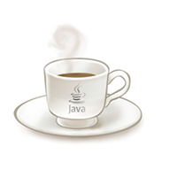
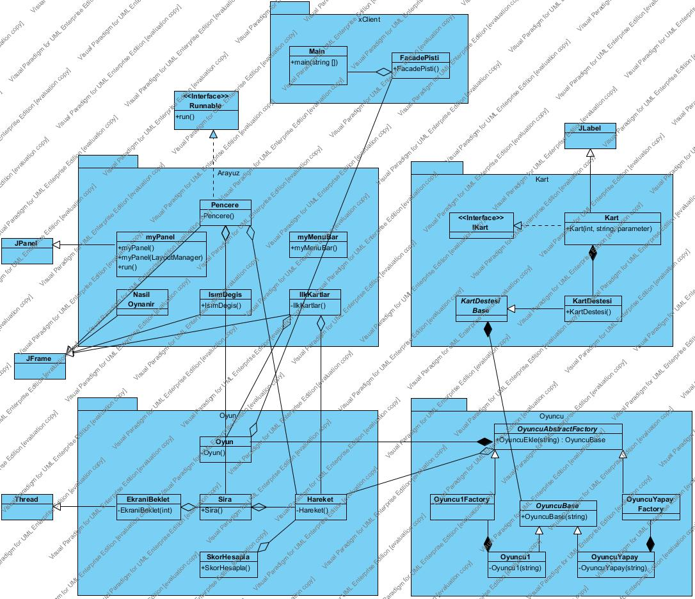

# Java Pişti Oyunu

2010 yılında java ile geliştirdiğim bir pişti oyunu.

Danışmanım: Öğr. Gör. ÖZGÜR ÇİFTÇİ

## UML Diagram

## Açıklama

Tasarım desenlerini öğrenme ve uygulama amaçlı geliştirilmiştir.

- Singleton Tasarım Deseni
- Factory Tasarım Deseni
- Bridge Tasarım Deseni
- Facade Tasarım Deseni

## Sınıflar ve paketler:

### xClient Package:

- Main.java
- FacadePisti.java

### Arayuz Package:

- Pencere.java
- myMenuBar.java
- myPanel.java
- NasilOynanir.java
- IsimDegis.java
- IlkKartlar.java

### Kart Package:

- IKart.java
- Kart.java
- KartDestesiBase.java
- KArtDestesi.java

### Oyun Package:

- Oyun.java
- Hareket.java
- Sira.java
- SkorHesapla.java
- EkraniBeklet.java

### Oyuncu Package:

- OyuncuAbstractFactory
- Oyuncu1Factory
- OyuncuYapayFactory
- OyuncuBase
- Oyuncu1
- OyuncuYapay

### Resim Packege:

- resimler klasörü

# Derleme ve Çalıştırma

Netbeans veya Eclipse ile proje açılırsa, derlenilip çalıştırılabilir.
